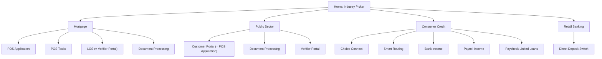
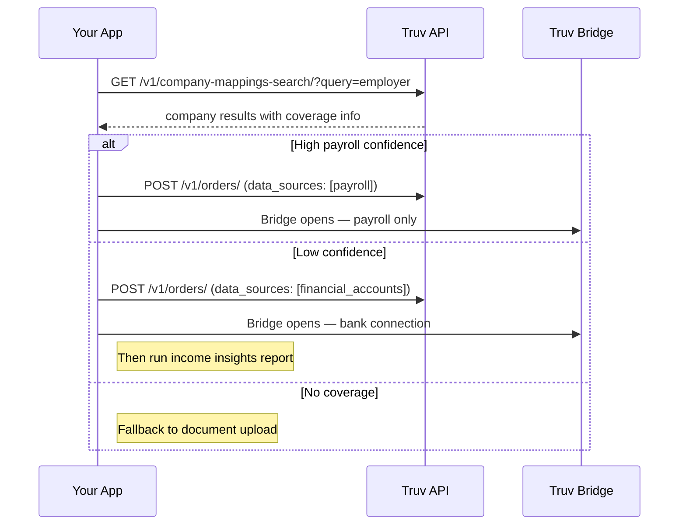

# feat: Restructure demos by industry with new Consumer Credit and Retail Banking patterns

## Overview

Restructure the entire demo app around 4 industry groups. The home page becomes an industry picker. Each industry shows its own demo list. Duplicate demos (LOS, Customer Portal, etc.) are copy-pasted into their own files with hardcoded industry-specific names — no shared config or prop abstraction. New demos are added for Consumer Credit (5) and Retail Banking (1).

**Industry groups and demos:**

| Industry | Demos | Notes |
|----------|-------|-------|
| **Mortgage** | POS Application, POS Tasks, LOS, Document Processing | LOS = Verifier Portal with different name |
| **Public Sector** | Customer Portal, Document Processing, Verifier Portal | Customer Portal = POS Application with different name |
| **Consumer Credit** | Choice Connect, Smart Routing, Bank Income, Payroll Income, PLL | All new demos |
| **Retail Banking** | Direct Deposit Switch | New demo |

## Problem Frame

The current flat demo list doesn't help prospects find the integration pattern relevant to their industry. A mortgage company, a lender, and a neobank all have different needs. By organizing demos by industry, prospects immediately see the patterns that matter to them. The same underlying flows (application, verifier portal, document processing) appear under multiple industries with contextual naming.

## Requirements Trace

- R1. Home page shows 4 industry cards (Mortgage, Public Sector, Consumer Credit, Retail Banking)
- R2. Clicking an industry shows that industry's demo list
- R3. Duplicate demos are copy-pasted into separate files with different hardcoded names (LOS = copy of Verifier Portal, Customer Portal = copy of POS Application)
- R4. Duplicate demos are functionally identical flows — just different names/badges hardcoded in each file
- R5. All Consumer Credit demos start with an application form before verification
- R6. Choice Connect: user picks between payroll, bank (transactions), or document upload
- R7. Smart Routing: system uses company_search confidence to auto-route to payroll, bank, or documents
- R8. Bank Income: application -> Bridge with `financial_accounts` data source -> income insights report
- R9. Payroll Income: application -> Bridge with `payroll` data source -> income report
- R10. PLL: application -> Bridge for paycheck-linked lending product
- R11. Direct Deposit Switch: application -> Bridge for deposit_switch product
- R12. Each demo has its own Mermaid architecture diagram and guided steps
- R13. The `data_sources` parameter controls which verification methods Bridge presents

## Scope Boundaries

- Not changing the internal behavior of existing demo components (Application, FollowUp, EmployeePortal, UploadDocuments)
- Not adding new report renderers — existing ones cover all needed report types
- Not implementing production-grade smart routing — confidence threshold is illustrative
- Not adding industry-specific API configurations — only names/labels differ per industry

## Context & Research

### Relevant Code and Patterns

- `src/App.jsx` — DEMOS registry + hash router (`#<demo>/<screen>/<param>`)
- `src/Home.jsx` — flat DEMOS array with DemoCard components
- `src/demos/Application.jsx` — Orders-based flow: IntroScreen → ApplicationForm → BridgeScreen → OrderWaitingScreen → OrderResultsScreen
- `src/demos/ConsumerCredit.jsx` — User+Token flow (to be replaced)
- `src/demos/FollowUp.jsx`, `src/demos/EmployeePortal.jsx`, `src/demos/UploadDocuments.jsx` — existing demos
- `src/components/screens/` — shared BridgeScreen, OrderWaitingScreen, OrderResultsScreen
- `src/components/Layout.jsx` — app shell with `badge` prop for header badge
- `server/truv.js` — TruvClient, `server/routes/orders.js` — order creation
- `server/routes/bridge.js` — User+Token bridge routes
- `server/routes/reports.js` — report fetching with REPORT_CONFIG

### Key Existing Patterns

**Hash routing:** `#<demo-id>/<screen>/<param>` parsed by `parseHash()` in App.jsx. `navigate()` sets `window.location.hash`.

**Demo registration:** Two-step — add component to DEMOS object in App.jsx, add metadata to DEMOS array in Home.jsx.

**Demo component props:** Each receives `{ screen, param }` from the router. Uses `screen` for internal navigation (bridge, waiting, results).

**Layout badge:** `<Layout badge="New Application">` — this is what changes per industry context.

## Key Technical Decisions

- **Two-level URL scheme:** Change routing from `#<demo>/<screen>/<param>` to `#<industry>/<demo>/<screen>/<param>`. When URL has only `#<industry>`, show that industry's demo list. When empty, show home (industry picker).

- **Config-driven demo registry:** Replace the flat DEMOS map with an `INDUSTRIES` config that maps each industry to its demos. Each demo entry specifies `component`, `name`, `desc`, `tags`.

- **Copy-paste for duplicates:** Duplicate demos (LOS, Customer Portal, shared Document Processing) get their own files that are copies of the source with hardcoded name/badge changes. No config prop abstraction — keeps each demo self-contained and simple to modify independently.

- **Orders flow for new demos:** All new Consumer Credit and Retail Banking demos use the Orders API (like Application demo) because they start with an application form. This means reusing BridgeScreen, OrderWaitingScreen, OrderResultsScreen.

- **`data_sources` on order creation:** Pass `data_sources` array through to control which verification methods Bridge presents.

- **Extract ApplicationForm:** Move from Application.jsx to shared component for reuse across demos.

## Open Questions

### Resolved During Planning

- **Home page structure:** 4 industry cards (user confirmed)
- **Duplicate demo behavior:** Same flow, different names only (user confirmed)
- **Demo grouping:** Mortgage (POS Application, POS Tasks, LOS, Documents), Public Sector (Customer Portal, Documents, Verifier Portal), Consumer Credit (Choice Connect, Smart Routing, Bank Income, Payroll Income, PLL), Retail Banking (DDS)

### Deferred to Implementation

- **Exact `data_sources` API placement:** Whether it goes on orders endpoint body or bridge token configuration — verify against Truv API docs
- **Smart Routing confidence field:** What field in company_search response indicates coverage confidence
- **Bank income report type:** Whether bank-sourced income uses `income_insights` report type or a different product_type

## High-Level Technical Design

> *This illustrates the intended approach and is directional guidance for review, not implementation specification. The implementing agent should treat it as context, not code to reproduce.*

### Navigation Architecture



### URL Scheme

```
#                                          → Home (industry picker)
#mortgage                                  → Mortgage demo list
#mortgage/pos-application                  → POS Application intro
#mortgage/pos-application/bridge/abc123    → POS Application bridge screen
#consumer-credit                           → Consumer Credit demo list  
#consumer-credit/smart-routing             → Smart Routing intro
#consumer-credit/bank-income/bridge/abc123 → Bank Income bridge screen
```

### Smart Routing Decision Flow



## Implementation Units

- [ ] **Unit 1: Restructure routing and home page for industry groups**

  **Goal:** Replace the flat home page and routing with industry-based navigation. Home shows 4 industry cards. Each industry page shows its demos. URL scheme changes to `#<industry>/<demo>/<screen>/<param>`.

  **Requirements:** R1, R2, R3, R4

  **Dependencies:** None

  **Files:**
  - Modify: `src/App.jsx`
  - Modify: `src/Home.jsx`
  - Create: `src/IndustryPage.jsx`
  - Create: `src/demos/LOS.jsx` (copy of EmployeePortal.jsx with name changes)
  - Create: `src/demos/CustomerPortal.jsx` (copy of Application.jsx with name changes)
  - Create: `src/demos/PSDocuments.jsx` (copy of UploadDocuments.jsx with name changes)

  **Approach:**

  *App.jsx — routing:*
  - Update `parseHash()` to extract 4 parts: `{ industry, demo, screen, param }` from `#<industry>/<demo>/<screen>/<param>`
  - Update `navigate()` to accept industry-prefixed paths
  - Replace flat `DEMOS` map with `INDUSTRIES` config — each industry has `id`, `name`, `desc`, `demos[]` where each demo has `id`, `name`, `component`, `desc`, `tags`
  - Route logic: no industry → `<Home>`, industry but no demo → `<IndustryPage>`, industry + demo → render component
  - Each demo component has its own file with hardcoded names — no config prop passing needed

  *Home.jsx — industry picker:*
  - Replace flat demo card list with 4 industry cards
  - Each card shows industry name, description, and number of demos
  - Cards link to `#<industry-id>`
  - Keep existing visual style (clean, Apple-inspired)

  *IndustryPage.jsx — demo list:*
  - New component showing demos for a selected industry
  - Industry name as header, demo cards below (similar to current home page cards)
  - Each card links to `#<industry>/<demo-id>`
  - Back navigation to home

  *Duplicate demos — copy-paste with name changes:*
  - `LOS.jsx`: copy `EmployeePortal.jsx`, change badge to "LOS", update `navigate()` paths to use `mortgage/los/...`
  - `CustomerPortal.jsx`: copy `Application.jsx`, change badge to "Customer Portal", update `navigate()` paths to use `public-sector/customer-portal/...`
  - `PSDocuments.jsx`: copy `UploadDocuments.jsx`, change badge to "Document Processing", update `navigate()` paths to use `public-sector/documents/...`
  - Existing demos (Application, FollowUp, EmployeePortal, UploadDocuments) update their `navigate()` calls to use the new `#<industry>/<demo>/...` paths

  **Patterns to follow:**
  - Current `Home.jsx` card styling for industry cards and demo cards
  - Current `App.jsx` hash routing pattern
  - Current Layout `badge` prop usage

  **Test scenarios:**
  - Happy path: Home shows 4 industry cards with names and descriptions
  - Happy path: Clicking "Mortgage" navigates to `#mortgage` and shows 4 demo cards
  - Happy path: Clicking "POS Application" under Mortgage navigates to `#mortgage/pos-application` and renders ApplicationDemo
  - Happy path: LOS under Mortgage renders LOS.jsx with "LOS" badge
  - Happy path: Customer Portal under Public Sector renders CustomerPortal.jsx with "Customer Portal" badge
  - Edge case: Direct URL `#mortgage/pos-application/bridge/123` renders the correct screen
  - Edge case: Invalid industry or demo slug shows home page
  - Edge case: Back navigation from demo → industry page → home works correctly

  **Verification:**
  - All existing demo flows work identically through new URLs
  - Industry picker renders cleanly with 4 groups
  - Duplicate demos show correct industry-specific names

- [ ] **Unit 2: Server — support `data_sources` in order creation**

  **Goal:** Allow the frontend to pass a `data_sources` array when creating orders, so Bridge only shows the specified verification methods.

  **Requirements:** R13

  **Dependencies:** None (can run in parallel with Unit 1)

  **Files:**
  - Modify: `server/truv.js`
  - Modify: `server/routes/orders.js`

  **Approach:**
  - Add `data_sources` to the params accepted by `routes/orders.js` POST handler and pass through to `truv.createOrder()`
  - In `truv.createOrder()`, include `data_sources` in the order payload when provided (omit when undefined to preserve default behavior)
  - Existing demos that don't pass `data_sources` remain unaffected

  **Patterns to follow:**
  - How `products` array is already passed through from route to TruvClient
  - How optional params like `company_mapping_id` are conditionally included

  **Test scenarios:**
  - Happy path: POST /api/orders with `data_sources: ['payroll']` passes it through to Truv API payload
  - Happy path: POST /api/orders without `data_sources` omits it from payload (backward compatible)
  - Edge case: POST /api/orders with empty `data_sources: []` — omit from payload to preserve defaults

  **Verification:**
  - Existing Application and Follow-Up demos still work unchanged
  - New orders created with `data_sources` include the parameter in the Truv API call (visible in API logs panel)

- [ ] **Unit 3: Server — add smart routing endpoint**

  **Goal:** Provide an endpoint that takes an employer query and returns a routing recommendation based on payroll coverage confidence.

  **Requirements:** R7

  **Dependencies:** None (can run in parallel with Units 1-2)

  **Files:**
  - Create: `server/routes/smart-route.js`
  - Modify: `server/index.js`

  **Approach:**
  - Add `GET /api/smart-route?q=<employer>&product_type=income` endpoint
  - Internally calls `truv.searchCompanies()` with the query
  - Evaluates the top result's coverage/confidence fields
  - Returns `{ recommendation: 'payroll' | 'bank' | 'documents', confidence: number, company: { name, company_mapping_id } }`
  - The confidence thresholds are configurable constants — illustrative for the demo
  - Log the company search API call via apiLogger

  **Patterns to follow:**
  - Existing `GET /api/companies` endpoint in `server/index.js`
  - Route factory pattern: `export default function smartRouteRoutes({ truv, apiLogger })`

  **Test scenarios:**
  - Happy path: Known employer returns `recommendation: 'payroll'` with high confidence
  - Happy path: Unknown employer returns `recommendation: 'bank'` or `recommendation: 'documents'`
  - Edge case: Empty query returns default recommendation (documents)
  - Edge case: Company search returns no results — fallback to documents

  **Verification:**
  - Endpoint returns a valid recommendation for any employer query
  - API call appears in the Panel's API tab

- [ ] **Unit 4: Extract shared ApplicationForm component**

  **Goal:** Make the application form reusable across Application and new Consumer Credit demos.

  **Requirements:** R5

  **Dependencies:** None (can run in parallel with Units 1-3)

  **Files:**
  - Create: `src/components/ApplicationForm.jsx`
  - Modify: `src/demos/Application.jsx`
  - Modify: `src/components/index.js`

  **Approach:**
  - Move `ApplicationForm` function from Application.jsx into `src/components/ApplicationForm.jsx`
  - Accept props: `onSubmit`, `submitting`, `productType`, `showEmployer` (default true), `employerLabel`
  - Keep CompanySearch integration inside ApplicationForm
  - Update Application.jsx to import from new location
  - Add to barrel export in `src/components/index.js`

  **Patterns to follow:**
  - Existing shared components in `src/components/` with barrel export
  - Current ApplicationForm structure in `src/demos/Application.jsx:219-268`

  **Test scenarios:**
  - Happy path: Application demo renders and submits the form identically to before extraction
  - Happy path: Form renders with custom `employerLabel` prop
  - Edge case: Form with `showEmployer: false` hides the company search field

  **Verification:**
  - Application demo behaves identically after extraction
  - No duplicate ApplicationForm code

- [ ] **Unit 5: Implement simple Consumer Credit patterns (Bank Income, Payroll Income, PLL) and Direct Deposit Switch**

  **Goal:** Implement the 4 straightforward patterns that all follow the same Orders flow: application form → Bridge with specific data_sources/product → waiting → results.

  **Requirements:** R5, R8, R9, R10, R11, R12

  **Dependencies:** Unit 1 (routing), Unit 2 (data_sources), Unit 4 (ApplicationForm)

  **Files:**
  - Create: `src/demos/BankIncome.jsx`
  - Create: `src/demos/PayrollIncome.jsx`
  - Create: `src/demos/DepositSwitch.jsx`
  - Create: `src/demos/PaycheckLinkedLoans.jsx`
  - Modify: `src/App.jsx` (register in INDUSTRIES config)

  **Approach:**
  - Each demo follows the Application.jsx pattern but simplified (no product picker intro — the product is predetermined)
  - Flow: Intro slide (name + architecture diagram) → ApplicationForm → create order with `product_type` and `data_sources` → BridgeScreen → OrderWaitingScreen → OrderResultsScreen
  - Each defines its own: STEPS array, Mermaid diagram, product_type, data_sources
  - Pattern config:
    - Bank Income: `product_type: 'income'`, `data_sources: ['financial_accounts']`
    - Payroll Income: `product_type: 'income'`, `data_sources: ['payroll']`
    - PLL: `product_type: 'pll'`, `data_sources: ['payroll']`
    - Direct Deposit Switch: `product_type: 'deposit_switch'`, `data_sources: ['payroll']`
  - Reuse all existing shared screen components
  - Accept `config` prop for industry-specific badge/name

  **Patterns to follow:**
  - `src/demos/Application.jsx` structure (IntroScreen → form → screens)
  - Hash routing with `navigate()` using `config.demoPath`

  **Test scenarios:**
  - Happy path: Bank Income — form submit → order with `data_sources: ['financial_accounts']` → Bridge → income insights report
  - Happy path: Payroll Income — form submit → order with `data_sources: ['payroll']` → Bridge → VOIE report
  - Happy path: PLL — form submit → order → Bridge → completion
  - Happy path: DDS — form submit → order → Bridge → completion
  - Happy path: Each demo's architecture diagram renders correctly
  - Edge case: Direct URL navigation to any screen within the flow works
  - Integration: Panel sidebar shows API logs, Bridge events, and webhooks

  **Verification:**
  - All 4 demos complete the full flow: intro → application → bridge → waiting → results
  - Each appears under the correct industry in the navigation

- [ ] **Unit 6: Implement Choice Connect pattern**

  **Goal:** Add the Choice Connect pattern where the user fills out the application, then selects one of three verification methods.

  **Requirements:** R5, R6, R13

  **Dependencies:** Unit 1 (routing), Unit 2 (data_sources), Unit 4 (ApplicationForm)

  **Files:**
  - Create: `src/demos/ChoiceConnect.jsx`
  - Modify: `src/App.jsx` (register in INDUSTRIES config)

  **Approach:**
  - Flow: Intro slide → ApplicationForm → "Choose Verification Method" screen with 3 cards:
    1. **Payroll** → creates order with `data_sources: ['payroll']` → BridgeScreen → results
    2. **Bank (Transactions)** → creates order with `data_sources: ['financial_accounts']` → BridgeScreen → results
    3. **Upload Documents** → enters document upload sub-flow (simplified from UploadDocuments demo)
  - Order creation deferred until after user's choice so correct `data_sources` are used
  - The choice screen uses the same card styling as other pattern pickers
  - For document upload path: create collection, upload, finalize, show income report

  **Patterns to follow:**
  - Product picker card UI from current ConsumerCredit.jsx
  - Document upload flow from UploadDocuments.jsx (simplified)
  - BridgeScreen + OrderWaitingScreen + OrderResultsScreen for payroll/bank paths

  **Test scenarios:**
  - Happy path: Pick "Payroll" → order with `data_sources: ['payroll']` → Bridge → report
  - Happy path: Pick "Bank" → order with `data_sources: ['financial_accounts']` → Bridge → income insights
  - Happy path: Pick "Upload Documents" → document collection flow → report
  - Edge case: Back from choice screen to form preserves form data
  - Integration: Choice visible in Panel Guide tab step progression

  **Verification:**
  - All 3 verification paths complete end-to-end
  - Panel tracks each path correctly

- [ ] **Unit 7: Implement Smart Routing pattern**

  **Goal:** Add the Smart Routing pattern where the system auto-routes to the best verification method based on employer payroll coverage.

  **Requirements:** R5, R7, R13

  **Dependencies:** Unit 1 (routing), Unit 2 (data_sources), Unit 3 (smart routing endpoint), Unit 4 (ApplicationForm)

  **Files:**
  - Create: `src/demos/SmartRouting.jsx`
  - Modify: `src/App.jsx` (register in INDUSTRIES config)

  **Approach:**
  - Flow: Intro slide → ApplicationForm → "Determining best method..." loading → routing result → appropriate path
  - After form submit, call `GET /api/smart-route?q=<employer>` with employer from form
  - Show routing result with visual indicator:
    - High confidence → "Payroll verification available" (green) → order with `data_sources: ['payroll']`
    - Low confidence → "Using bank verification" (yellow) → order with `data_sources: ['financial_accounts']`
    - No coverage → "Document upload required" (gray) → document upload sub-flow
  - Brief pause on result screen so user sees the decision, then "Continue" button
  - Routing decision and confidence visible in Panel API tab

  **Patterns to follow:**
  - Loading spinner from OrderWaitingScreen
  - Status indicator from StatusBadge component

  **Test scenarios:**
  - Happy path: Known employer → routes to payroll Bridge
  - Happy path: Unknown employer → routes to bank or documents
  - Edge case: Smart route endpoint error → graceful fallback to documents
  - Edge case: Empty employer → documents fallback
  - Integration: Routing API call visible in Panel with timing

  **Verification:**
  - Routing decision displays clearly before advancing
  - Each path (payroll, bank, documents) completes the full flow
  - Visually distinct from Choice Connect (automatic vs manual)

- [ ] **Unit 8: Remove old ConsumerCredit.jsx and clean up**

  **Goal:** Remove the old Consumer Credit demo and ensure all references point to the new industry-based structure.

  **Requirements:** R1, R2

  **Dependencies:** Units 5-7 (all new demos implemented)

  **Files:**
  - Delete: `src/demos/ConsumerCredit.jsx`
  - Modify: `src/App.jsx` (remove old import)

  **Approach:**
  - Remove the old ConsumerCredit component and its import
  - Verify all industry configs reference the correct new demo components
  - Verify home page subtitle/description is updated (no longer "Five integration patterns")

  **Test scenarios:**
  - Happy path: No broken imports or references to old ConsumerCredit
  - Happy path: All 4 industry groups render their demos correctly
  - Edge case: Old URL `#consumer-credit` redirects to the Consumer Credit industry page

  **Verification:**
  - App loads without errors
  - All navigation paths work end-to-end

## System-Wide Impact

- **Interaction graph:** Existing webhook receiver, BridgeScreen, OrderWaitingScreen, OrderResultsScreen unchanged. New demos feed into them via the same order → bridge → webhook → report flow.
- **Error propagation:** Order creation failures surface via existing error handling in routes/orders.js. Smart routing failures fall back to document upload.
- **State lifecycle risks:** Industry/demo selection state must reset cleanly on navigation. usePanel() reset handles polling cleanup.
- **API surface parity:** No external API changes. New endpoints (smart-route) are internal to the quickstart.
- **URL breaking change:** Old URLs like `#application` will no longer work — they need `#mortgage/pos-application`. This is acceptable for a demo app.
- **Unchanged invariants:** Demo component internals remain unchanged. Duplicates are independent copies — editing LOS.jsx won't affect EmployeePortal.jsx.

## Risks & Dependencies

| Risk | Mitigation |
|------|------------|
| URL scheme change breaks bookmarks/links | Acceptable for a demo app; old flat URLs simply show home page |
| `data_sources` API parameter placement differs from assumption | Verify against Truv API docs early in Unit 2; small change to adjust |
| Smart routing confidence field may not exist in company_search response | Demo can use simulated confidence based on result count/quality |
| 4 new demo files + 3 copy-paste duplicates add to codebase size | Each follows the established pattern; copies are self-contained and easy to maintain independently |

## Sources & References

- Related code: `src/App.jsx`, `src/Home.jsx`, `src/demos/Application.jsx`, `src/demos/ConsumerCredit.jsx`, `server/routes/orders.js`, `server/truv.js`
- Truv API: `data_sources` parameter (enum<string>[] — payroll, docs, insurance, financial_accounts, tax)
- Truv Bridge SDK loaded via `https://cdn.truv.com/bridge.js`
